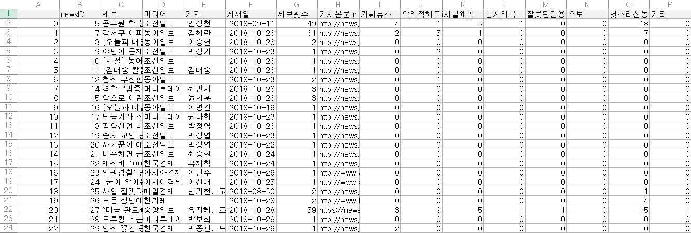

- 현재 마무리단계(2021-02-16)
- 내용 정리 및 코드정리 진행중
---
# 문맥과 독자들의 반응을 활용한 가짜뉴스 탐지 모델
## naver-news-crawler
- 2019~2020 네이버뉴스 정치, 경제, 사회 분야의 기사를 크롤링
- 약 79만건의 뉴스기사 수집
- 코드 참고 링크 : https://github.com/lumyjuwon/KoreaNewsCrawler
__naver news Results__ 

__[네이버 뉴스 감정표현 데이터]__ 

## reportrash-crawler
- 가짜뉴스 데이터셋 구축을 위한 레포트래시(https://www.reportrash.com/) 사이트 크롤링
- 약 3만 6천건의 부적절한 기사로 제보받은 뉴스기사 데이터 수집

__reportrash crawling results__ 

---
## 데이터셋 구축
- 레포트래시 제보 기사 중, 제보 횟수 및 기사 평가를 Label 로하여 , 임계값을 정한 후 가짜뉴스 데이터셋으로 구축
- 분야와 언론사별 특성을 고려하여, 제보되지 않으며 독자의 반응
### modeling
